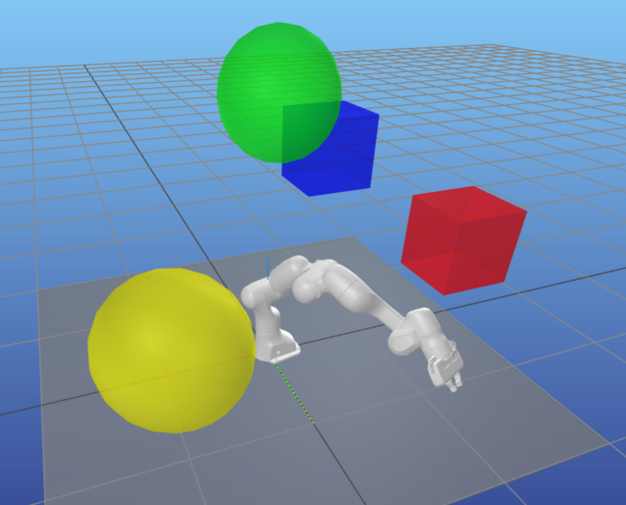

Design
======

Robot Modeling
^^^^^^^^^^^^^^

Motion planning first requires a **model** of the robot.
This model must describe:

* Robot kinematics (and possibly its dynamics).
* Geometries of the robot and its environment for visualization and collision checking.
* Names of joints and/or coordinate frames that are used for motion planning.
* Support for importing standard robot description file formats such as `URDF <https://wiki.ros.org/urdf>`_.

One software package that has all these capabilities is `Pinocchio <https://github.com/stack-of-tasks/pinocchio>`_.
It is actively maintained and therefore open to contributions, and is performant because it is written in C++ with first-class Python bindings.
This applies to both Pinocchio itself, and the `HPP-FCL <https://github.com/humanoid-path-planner/hpp-fcl>`_ library used internally for collision checking.

For completeness, other good alternatives for robot modeling would be `Drake <https://drake.mit.edu/>`_, `MuJoCo <https://mujoco.readthedocs.io/>`_, and `Robotics Toolbox for Python <https://petercorke.github.io/robotics-toolbox-python/>`_.

Pinocchio offers several methods of visualization; in this package, we use `MeshCat <https://github.com/meshcat-dev/meshcat>`_.

Motion Planning
^^^^^^^^^^^^^^^

While ``pyroboplan`` extensively relies on other tools (mostly Pinocchio) for robot modeling, it implements several components of motion planning from scratch.
The goal of this library is **learning and education**, and as such its design philosophy is as follows:

* Motion planning components (inverse kinematics, motion planning, trajectory generation, etc.) must be easy to mix and match.
* There is no need for unnecessarily "fancy" software techniques like factories or excessive inheritance. It's OK for different implementations to have slightly different interfaces if it makes sense.
* The math must always be explained, and resources to relevant papers, lectures, tutorials, etc. should be cited wherever possible.
* Visualization, debugging, and clarity of code is key and should be prioritized in factor of efficiency/performance.

Of course, motion planning is a vast field and this library will never have all the implementations available.
This is where we hope that you will be inspired by this project to do some learning yourself, implement new capabilities, and share your contributions with the community.

If you are looking for motion planning libraries that are less education-focused and more capable, some of the standard ones used in practice are:

* `Drake <https://drake.mit.edu/>`_: Contains tools for system modeling and optimization-based planning and control.
* `MoveIt <https://moveit.picknik.ai/>`_: A ROS based framework with a plugin-based system for inverse kinematics, motion planning, and pre-/post-processing. Best known for its interface to `Open Motion Planning Library (OMPL) <https://ompl.kavrakilab.org/>`_ for sampling-based motion planning.
* `Tesseract <https://tesseract-docs.readthedocs.io/>`_: A library inspired by MoveIt concepts, but written to better decouple the code functionality and ROS interfaces, and with a bigger focus on trajectory optimization.
* `OCS2 <https://leggedrobotics.github.io/ocs2/>`_ and `Crocoddyl <https://cmastalli.github.io/publications/crocoddyl20icra.html>`_: Packages based on Pinocchio for optimization-based online control.

Software Practices
^^^^^^^^^^^^^^^^^^

Even though the implementations of motion planning algorithms themselves aren't held to a "professional" software engineering standard, in favor of educational goals, all the supporting infrastructure is still (somewhat) professional.

* **Versioning:** This library will be versioned using the typical `SemVer <https://semver.org/>`_ specification and periodically released.
* **Documentation:** Ensure that all of your modules, top-level files, and functions have docstrings, as they get autogenerated into this doc page. You can look at existing files for inspiration, and generate the docs locally to check how things look.
* **Unit testing:** Testing is awesome at ensuring your code works as intended and doesn't break other things. You should implement tests for whatever you write!
