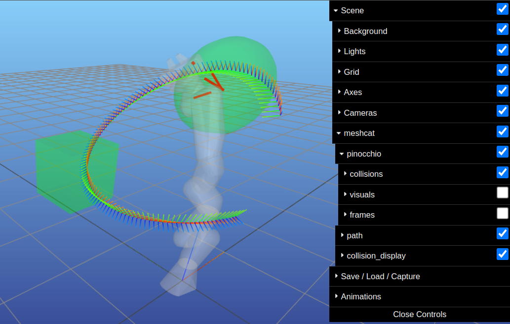
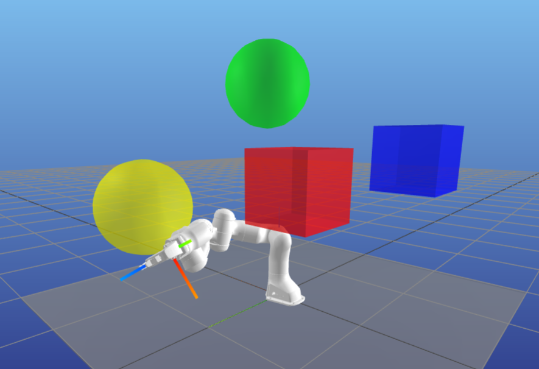
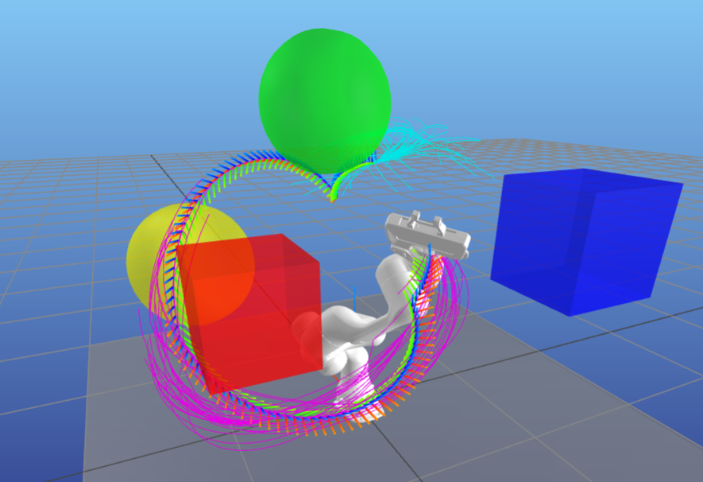
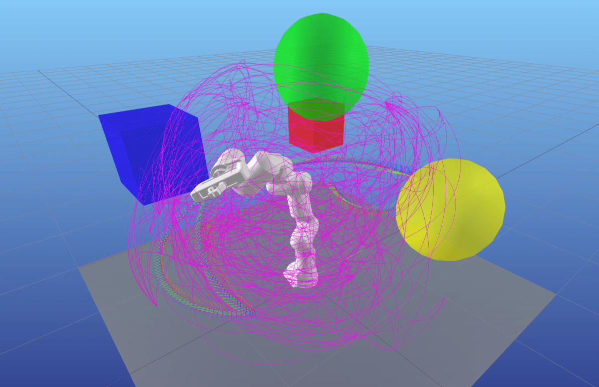
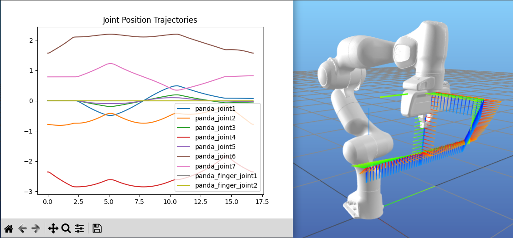
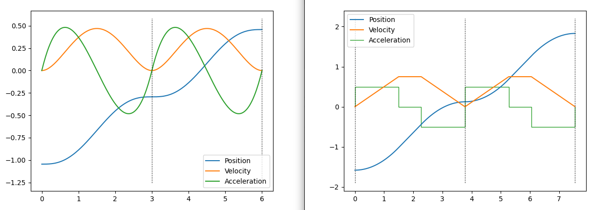

Motion Planning
===============

Motion planning is a broad area of robotics, and often consists of several components.
In this page, we will discuss some of these components and where you can find them within the ``pyroboplan`` library.

Robot Modeling and Kinematics
^^^^^^^^^^^^^^^^^^^^^^^^^^^^^

`Pinocchio <https://github.com/stack-of-tasks/pinocchio>`_ offers all the tools necessary to perform basic robot modeling.

You can either create models manually or import them from URDF files as follows.

.. code-block:: python

    import pinocchio

    filename = "/path/to/your.urdf"
    model, collision_model, visual_model = pinocchio.buildModelsFromUrdf(filename)

With these models, you can perform fundamental operations for motion planning.
These include **forward kinematics** (computing transforms from joint positions) and computing the **Jacobian** (matrix that relates joint velocities to Cartesian space velocities) at a specific frame.

.. code-block:: python

    data = model.createData()
    target_frame_id = model.getFrameId("my_frame")

    # Forward kinematics
    pinocchio.framesForwardKinematics(model, data, q_target)
    my_frame_transform = data.oMf[target_frame_id]

    # Jacobian
    jac = pinocchio.computeFrameJacobian(
        model, data, q, target_frame_id, pinocchio.ReferenceFrame.LOCAL,
    )

You can also use the collision model to perform collision checking at specific states.
This uses the `HPP-FCL <https://github.com/humanoid-path-planner/hpp-fcl>`_ library internally, as well as a list of the active collision pairs in the model.
While the example below activates all collision pairs, this is not always useful since there may be bodies that can never collide, or bodies that always collide because of how the geometric primitives or meshes are placed in the model.
Some tools like the `MoveIt Setup Assistant <https://moveit.picknik.ai/main/doc/examples/setup_assistant/setup_assistant_tutorial.html>`_ generate "good" lists of collision pairs automatically by sampling over the set of valid robot states and checking collisions.

.. code-block:: python

    data = model.createData()
    collision_data = collision_model.createData()
    collision_model.addAllCollisionPairs()
    results = pinocchio.computeCollisions(
        model, data, collision_model, collision_data, q, False,
    )

The :examples:`Introduction to Pinocchio examples folder <intro_pinocchio>` includes code examples for robot models that are manually created and automatically imported from URDF.

Additionally, the `pyroboplan.core module <api/pyroboplan.core.html>`_ contains several tools that abstract away such common Pinocchio operations for motion planning.
One example can be found :examples:`here <example_collision_along_path.py>`.

Inverse Kinematics
^^^^^^^^^^^^^^^^^^

Inverse kinematics (IK) computes the joint states necessary to achieve a target Cartesian pose (position and orientation) for a specific coordinate frame.

Most high-level autonomy components describing a robot's desired behavior, such as grasp planners, perception systems, or tool path generators provide goals to a robot in terms of Cartesian poses.
On the other hand, path planners require a joint configuration as a goal state.
As such, IK is a common capability that most robots need to have in order to connect high-level and low-level planning.

If you have a relatively simple robot, you can analytically solve for a solution to the IK problem.
However, for most robotics applications, we rely on **numerical methods** instead for a variety of reasons, including:

* Robots with more than 6 degrees-of-freedom almost never have a single analytical IK solution.
* Additional constraints, such as joint limits, Cartesian pose limits, or collision avoidance, are difficult to enforce analytically.

The `pyroboplan.ik module <api/pyroboplan.ik.html>`_ contains implementations for IK solvers.
You can also try running the :examples:`differential IK example <example_differential_ik.py>`.

Free-Space Path Planning
^^^^^^^^^^^^^^^^^^^^^^^^

This is probably the most common task that comes up when we describe motion planning: moving from one configuration to another without colliding or violating operational limits.

There are several techniques for path planning, which can roughly be broken down into:

* **Graph Search**: Discretize the environment and perform exhaustive search to achieve a goal.
  Common examples include breadth-/depth-first search, Dijkstra's algorithm, and A* and all its variants.
* **Sampling-Based Planning**: Similar to graph search, except the graph is built up by randomly sampling the environment to manage computational complexity.
  Common examples include Probabilistic Roadmaps (PRM) and Rapidly-exploring Random Trees (RRT), with all their variants.
* **Optimization-Based Planning**: Uses optimization techniques to produce a solution,
  which can be represented as a list of states to pass through at a specified time step (known as *direct transcription*) or the parameters of a mathematical model that describe the motion (known as *direct collocation*).

When the configuration space is low dimensional (e.g., 2 degrees of freedom for mobile planar robots), simple approaches such as graph search or basic sampling-based planners can be very effective.
These planners can efficiently explore the space and find feasible paths without requiring significant computational resources.

However, as the dimensionality of the configuration space increases (e.g., multi-joint robots or robots with complex constraints), the complexity of the planning problem grows exponentially.
In higher-dimensional spaces, planners need to manage a vast number of potential configurations, making it impractical to perform exhaustive search or naive sampling.
Many approaches have been developed to optimize, tune, or otherwise modify basic planning implementations to account for these larger configuration spaces.
`Motion Planning in Higher Dimensions <https://motion.cs.illinois.edu/RoboticSystems/MotionPlanningHigherDimensions.html>`_ offers a nice, more comprehensive introduction to the topic.

One thing to note is that these planning approaches can actually produce a **path** (basically, only the waypoints) or a **trajectory** (waypoints along with their timing).

Some motion planning techniques simply produce a path, and then the path is passed into a separate **trajectory generation** step.
Others perform **kinodynamic planning**, meaning that the trajectory itself is generated by the planner, which can be passed directly to your robot.

Another distinction is that planners can be **offline** (a full plan is generated and later executed) versus **online** (plans are regenerated and updated as the robot executes).
Currently, all the planners in ``pyroboplan`` (such as RRT and Cartesian interpolation) are offline planners.
Online planning and control is often done through optimization techniques like Model Predictive Control (MPC).

The `pyroboplan.planning module <api/pyroboplan.planning.html>`_ contains implementations for a number of motion planners.
You can also try running the :examples:`RRT example <example_rrt.py>`, :examples:`PRM example <example_prm.py>`, or the :examples:`Cartesian planning example <example_cartesian_path.py>`.

Trajectory Generation
^^^^^^^^^^^^^^^^^^^^^

As mentioned in the previous section, if you are using a planner that simply outputs a path containing waypoints, these must be converted into a trajectory containing timing information on how to move through these waypoints.
Often, a fixed set of kinematic (position/velocity/acceleration/jerk) and dynamic (force/torque) limits of the robot are taken into account.
Sometimes, these limits can also be task-dependent; for example, if manipulating fragile objects or objects that cannot be placed in certain configurations (e.g., moving a glass of water without spilling).

The `pyroboplan.trajectory module <api/pyroboplan.trajectory.html>`_ contains trajectory generation implementations.
You can also try running the :examples:`trajectory generation example <example_trajectory_generation.py>`.

